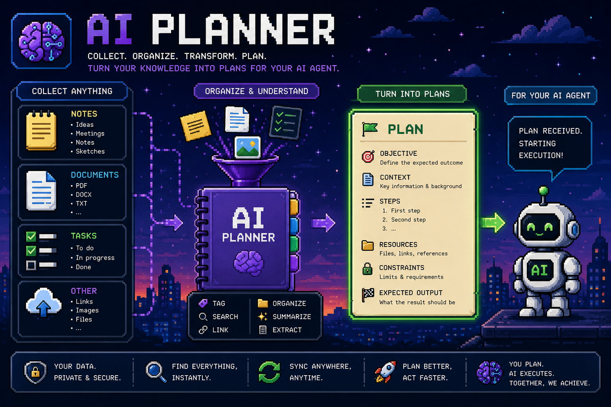

<div align="center">

# AI Planner



**Collect anything. Organize & understand. Turn your knowledge into plans for your AI agent.**

Capture typed **notes**, **tasks**, and **documents** about your software projects —
organized by project and DDD bounded context — make them **searchable** (full‑text + semantic),
and hand them to an AI agent (Claude Code) over an **MCP server** to generate typed,
versioned **artifacts** such as a Development Plan.

</div>

---

## What it is

AI Planner is a small, **fully decoupled** system for turning scattered project knowledge into
structured, AI‑generated deliverables:

1. **Collect** — notes (requirement / constraint / decision / question / snippet / reference),
   tasks (with dependencies), and uploaded documents (PDF / DOCX / MD / TXT), each scoped to a
   project and an optional DDD **domain** (bounded context).
2. **Organize & understand** — tag, link, and **search** across everything: exact words inside
   files (Postgres full‑text), by meaning (Qdrant vectors), or both fused (hybrid RRF).
3. **Turn into plans** — an AI agent pulls the assembled context through the MCP server, picks an
   **artifact type** (its instructions + file manifest), and writes back a **typed, versioned**
   multi‑file artifact (e.g. a Development Plan with phases it can mark done as it implements).
4. **For your AI agent** — the agent reads context, produces the declared files, saves the
   artifact, iterates to new versions, and updates execution phases live.

Everything runs locally; your data stays in your Postgres + Qdrant.

---

## Features

- **Projects & domains** — DDD bounded contexts with ubiquitous‑language tables; per‑project tech
  stack (language / framework / database / tool) with versions.
- **Notes** — typed, markdown, tagged, optionally domain‑scoped; fast quick‑capture composer.
- **Tasks** — status board (Todo / In Progress / Done), priorities, tags, **dependencies** with an
  automatic **blocked** flag and cycle rejection; optimistic inline edits.
- **Documents** — drag‑and‑drop upload, text extraction, dual indexing, extracted‑text preview,
  download.
- **Search** — lexical, semantic, and hybrid; scopable by project/domain; a File Explorer that
  searches **inside** file contents, grouped by project.
- **Artifact types** — define your own output types (instructions + file manifest); the built‑in
  **Development Plan** ships by default and is non‑deletable.
- **Artifacts** — multi‑file, versioned; manifest‑coverage indicator, per‑file version **diff**,
  execution **phase** checklist, export (single file or zip), links back to source notes/tasks.
- **Templates** — snapshot a project as a template; create new projects from one.
- **Skills** — attach GLOBAL skills to projects or define PROJECT skills; upload `.md` with
  frontmatter.
- **MCP server** — 20 tools exposing all of the above to Claude Code over stdio or SSE.

---

## Architecture

A monorepo of independently‑built services that talk **only over HTTP** — no shared in‑process
imports across deliverables.

| Service | Stack | Role |
|---------|-------|------|
| `backend/` | FastAPI · SQLAlchemy · Alembic · PostgreSQL · Qdrant/FastEmbed | REST API; owns all data (Postgres = source of truth, Qdrant = rebuildable vectors) |
| `mcp/` | Python · FastMCP · httpx | Exposes the backend to an AI agent (stdio / SSE); calls the API over HTTP |
| `frontend/` | Next.js 16 · React 19 · shadcn/ui · framer‑motion · SWR · Tailwind v4 | Capture & browsing UI |
| infra | `docker-compose` | Postgres · Qdrant · backend · mcp · frontend on one network |

```
                 ┌────────────┐        ┌──────────┐
   Browser ────► │  frontend  │ ─HTTP─►│          │ ─►  PostgreSQL  (entities, full‑text)
                 └────────────┘        │ backend  │
   Claude Code ─► ┌────────┐  ─HTTP─►  │  (API)   │ ─►  Qdrant      (semantic vectors)
                  │  mcp   │           │          │
                  └────────┘           └──────────┘
```

**Backend layering (Hexagonal / DDD):** `domain` (pure) ← `application` (services + invariants) ←
`infrastructure` (SQLAlchemy, Qdrant, FastEmbed, storage) ; `api` (thin routers) → `application`.
No reverse dependencies.

---

## Quick start — run the whole stack

**Prerequisites:** Docker + Docker Compose.

```bash
cp .env.example .env          # localhost defaults (adjust ports if they collide)
docker compose up --build     # postgres, qdrant, backend, mcp, frontend
```

Startup is healthcheck‑gated: **postgres + qdrant healthy → backend (migrates on start) →
mcp + frontend**. Services reference each other by compose name (`backend:8000`, `qdrant:6333`).

| Service | URL |
|---------|-----|
| **Frontend** | http://localhost:3000 |
| **Backend API + docs** | http://localhost:8000 · http://localhost:8000/docs |
| **MCP (SSE)** | http://localhost:8050/sse |
| **Qdrant dashboard** | http://localhost:6333/dashboard |

Restarting any single service never requires rebuilding the others:

```bash
docker compose restart mcp          # backend, frontend, data stay up
docker compose down                 # stop everything (volumes persist)
```

> **Port note:** this repo's local `.env` remaps host ports (backend `8088`, Postgres `5544`,
> Qdrant `6343`) to avoid colliding with other stacks, and sets
> `NEXT_PUBLIC_API_URL=http://localhost:8088` so the browser bundle targets the published backend
> port. `.env.example` keeps the conventional `8000 / 5432 / 6333` defaults.

---

## Configuration

All variables live in `.env` (copy from `.env.example`); every one has a sensible localhost default.

| Variable | Default | Used by |
|----------|---------|---------|
| `POSTGRES_DB` / `POSTGRES_USER` / `POSTGRES_PASSWORD` | `projectnotes` | postgres, backend |
| `POSTGRES_PORT` | `5432` | host‑published Postgres port |
| `QDRANT_HTTP_PORT` / `QDRANT_GRPC_PORT` | `6333` / `6334` | host‑published Qdrant ports |
| `DATABASE_URL` | `postgresql+psycopg://…@localhost:5432/projectnotes` | local backend runs |
| `QDRANT_URL` | `http://localhost:6333` | local backend runs |
| `EMBEDDING_MODEL` | `BAAI/bge-small-en-v1.5` | FastEmbed (CPU) |
| `BACKEND_PORT` | `8000` | host‑published backend port |
| `CORS_ORIGINS` | `http://localhost:3000` | backend CORS allow‑list |
| `MCP_TRANSPORT` | `sse` | mcp container transport (`sse` \| `streamable-http`) |
| `MCP_PORT` | `8050` | host‑published MCP port |
| `NEXT_PUBLIC_API_URL` | `http://localhost:8000` | **browser‑reachable** backend URL, baked into the frontend bundle |
| `FRONTEND_PORT` | `3000` | host‑published frontend port |

---

## Use it with Claude Code (MCP)

The MCP server gives Claude Code 20 tools — discovery (`list_projects`,
`get_project_context`), artifact types, artifacts + versions, notes/tasks/documents, skills,
`search_knowledge` (lexical / semantic / hybrid), `prepare_generation` (the unified context
bundle), and the writes `save_artifact` + `update_phase_status`.

**Register it** (copy into your Claude Code MCP config):

- **stdio** (simplest for local use) — [`mcp/.mcp.stdio.json`](./mcp/.mcp.stdio.json):
  ```json
  { "mcpServers": { "project-notes": {
      "command": "uv", "args": ["run", "python", "-m", "project_notes_mcp"],
      "cwd": "/path/to/AI-Planner/mcp", "env": { "BACKEND_URL": "http://localhost:8088" } } } }
  ```
- **SSE** (the always‑on compose service) — [`mcp/.mcp.sse.json`](./mcp/.mcp.sse.json):
  ```json
  { "mcpServers": { "project-notes": { "type": "sse", "url": "http://localhost:8050/sse" } } }
  ```

**The loop:** `list_artifact_types(project)` → `prepare_generation(project, "development-plan")`
→ the agent produces the declared files → `save_artifact(...)` (same title ⇒ a new version) →
`update_phase_status(...)` as it implements. See [`mcp/README.md`](./mcp/README.md) for details.

---

## Local development (per service)

Each service runs on its own; you only need Postgres + Qdrant up (`docker compose up -d postgres qdrant`).

**Backend** — Python 3.12, [uv](https://docs.astral.sh/uv/):
```bash
cd backend && uv sync
uv run alembic upgrade head                 # 15 tables + GIN indexes + seed
uv run uvicorn app.main:app --reload        # http://localhost:8000/docs
```

**MCP** — talks to the running backend over HTTP:
```bash
cd mcp && uv sync
BACKEND_URL=http://localhost:8088 uv run python -m project_notes_mcp   # stdio (default)
```

**Frontend** — Node 20.9+ (Node 24 recommended):
```bash
cd frontend && npm install
NEXT_PUBLIC_API_URL=http://localhost:8088 npm run dev   # http://localhost:3000
npm run build                                            # production build
```

---

## Testing

```bash
cd backend && uv run pytest      # 53 tests: schema + API + search/documents/templates
cd mcp     && uv run pytest      # 34 tests: client, formatting, tools, server (mock‑backed)
cd frontend && npm run test:e2e  # Playwright smoke (uses system Chrome)
```

Backend tests run migrations against the compose Postgres and verify the real schema + API
behaviour; MCP tests back the client with `httpx.MockTransport` (no live backend needed); the
frontend smoke checks every route renders without runtime errors.

---

## Project structure

```
AI-Planner/
├─ backend/                  # FastAPI + Postgres + Qdrant/FastEmbed
│  ├─ app/{domain,application,infrastructure,schemas,api}/   # hexagonal layers
│  ├─ alembic/               # migrations
│  └─ tests/
├─ mcp/                      # FastMCP server (HTTP → backend only)
│  ├─ project_notes_mcp/{config,client,formatting,tools,server,__main__}.py
│  ├─ .mcp.stdio.json / .mcp.sse.json
│  └─ tests/
├─ frontend/                 # Next.js 16 App Router
│  ├─ src/lib/{api,types,format}.ts          # typed client mirroring the OpenAPI
│  ├─ src/components/                         # ui (shadcn), shared, per‑surface features
│  ├─ src/app/                                # routes
│  └─ e2e/                                    # Playwright smoke
├─ docker-compose.yml        # all 5 services, healthcheck‑gated
├─ .env.example
└─ IMPLEMENTATION_PLAN.md    # the full, phased build plan
```

---

## Tech stack

**Backend:** FastAPI · SQLAlchemy 2 · Alembic · PostgreSQL 16 (`tsvector`/GIN full‑text) ·
Qdrant · FastEmbed · pydantic‑settings · uv.
**MCP:** Python · FastMCP (`mcp` SDK) · httpx.
**Frontend:** Next.js 16 (App Router, Turbopack) · React 19 · TypeScript · Tailwind v4 ·
shadcn/ui · framer‑motion · SWR · react‑markdown.
**Infra:** Docker Compose · multi‑stage images · named volumes for Postgres, Qdrant, and document
storage.

See [`IMPLEMENTATION_PLAN.md`](./IMPLEMENTATION_PLAN.md) for the complete phased plan and design
decisions.
